# Aplikasi MyWebinar
### Nama : Reynaldi Nugraha Putra
### NIM : 312410278
### Kelas : I241D
### Mata Kuliah : Pemrograman Mobile Pertemuan 8 / UTS
### Dosen Pengampu : Donny Maulana, S.Kom., M.M.S.I.
# 

## 📝 Deskripsi Project (Update UTS)
Proyek ini merupakan implementasi aplikasi **MyWebinar** pada Android Studio. Aplikasi ini berfungsi untuk manajemen pendaftaran webinar, akses sertifikat, dan kini telah dilengkapi dengan fitur **AI Chatbot** sebagai asisten cerdas bagi pengguna.

### Fitur Terbaru: AI Chatbot Asisten
<p align="center">
  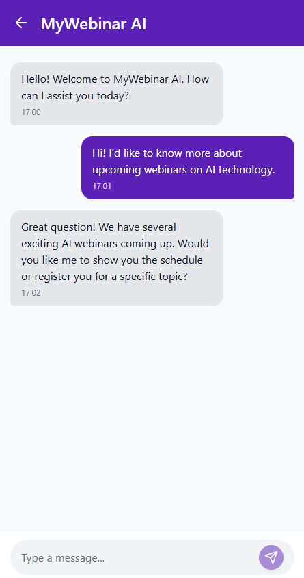
</p>
  
*   **Integrasi AI**: Menggunakan API untuk menjawab pertanyaan seputar jadwal dan teknis webinar.
*   **Smart Assistant**: Membantu pengguna melakukan pencarian topik webinar secara otomatis melalui perintah teks.

- [Link Figma](https://www.figma.com/make/rfmdHkmT6GqeyeViMq5wMx/Design-mobile-AI-Chatbot?fullscreen=1&t=NRizYNtsDBTcvFli-1)

---

### 1. Splash Screen
<p align="center">
  
  
  
</p>

---

### 2. StoryBoard Project
<p align="center">
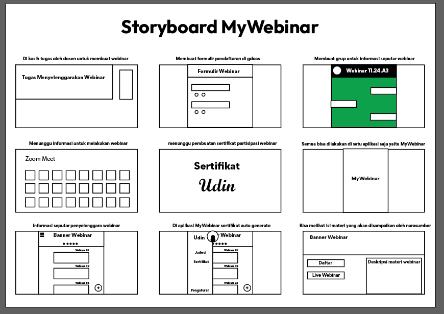
</p>
<br>

---

### 3. Mockup Project
<p align="center">
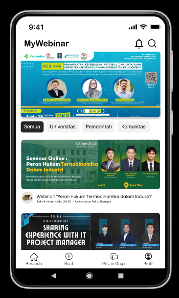
</p>

---

### 4. Wireframe 
<p align="center">
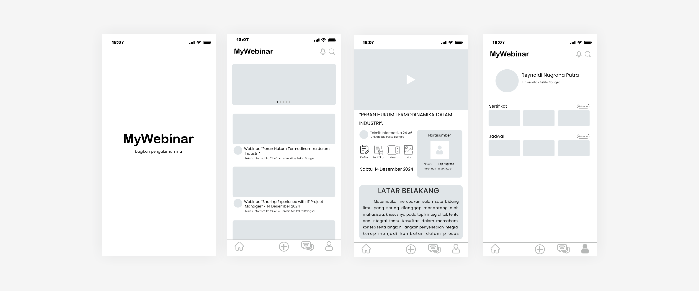
</p>
<br>

---

### 5. UI (User Interface) Project
<p align="center">
  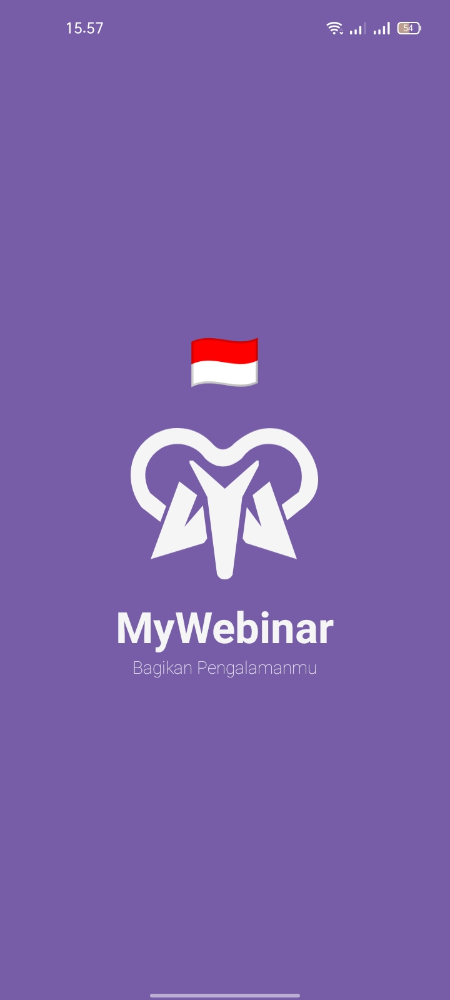
  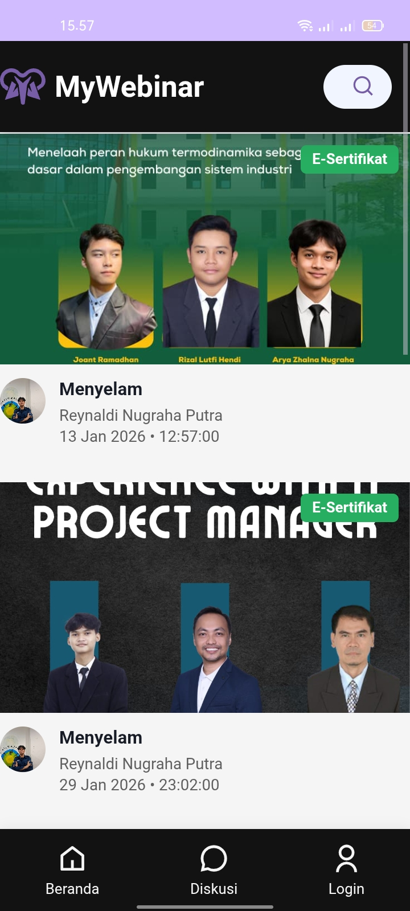
  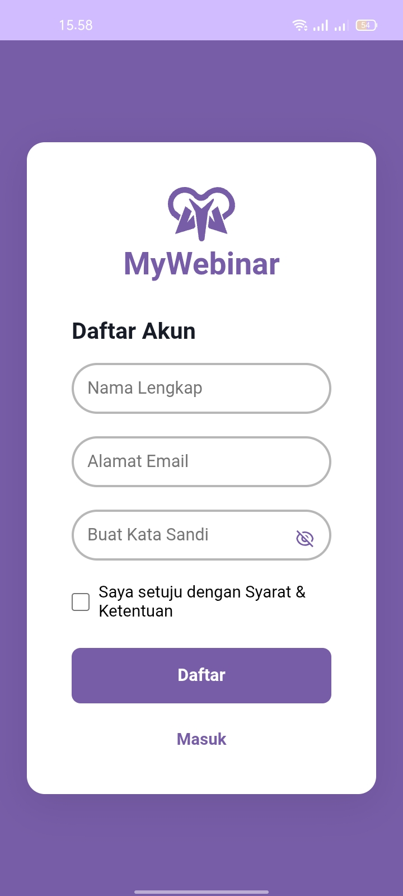
  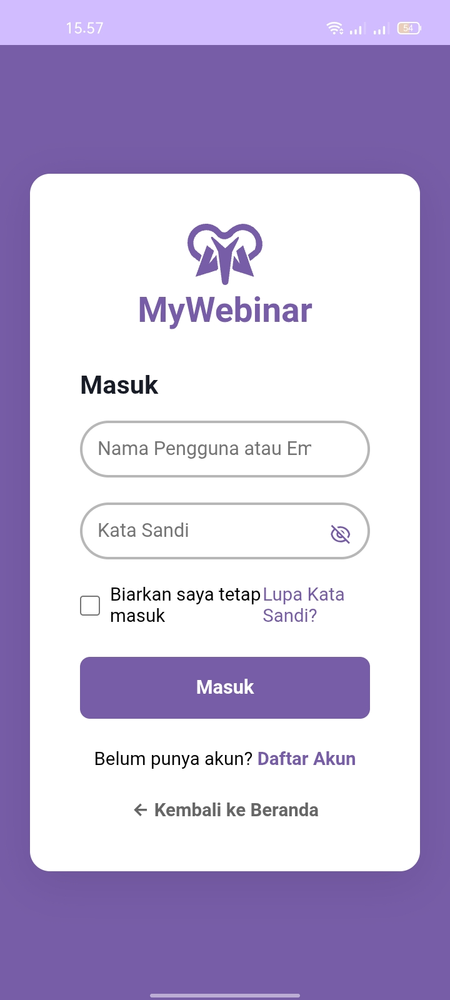
  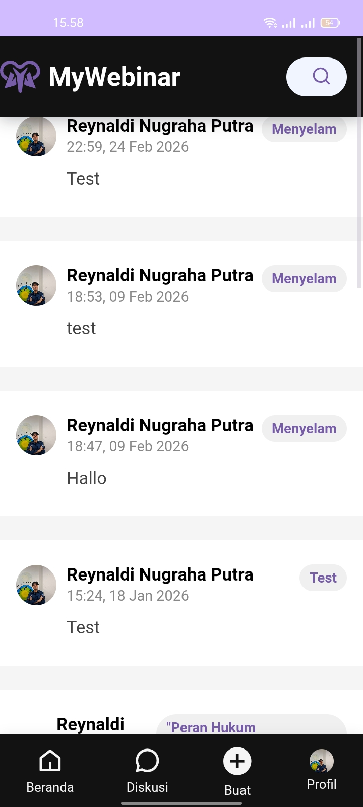
  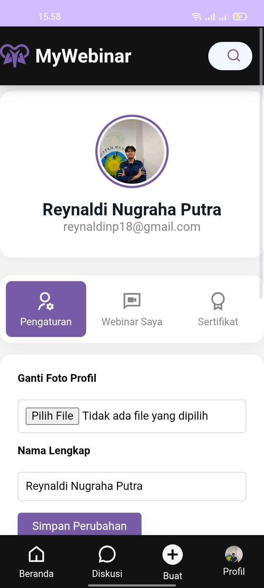
  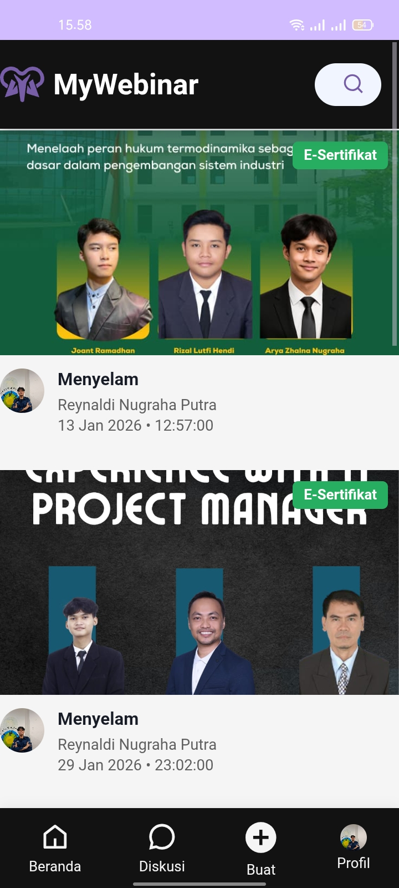
  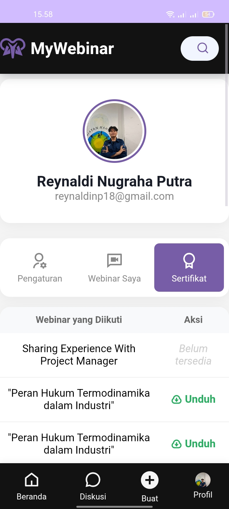
  
  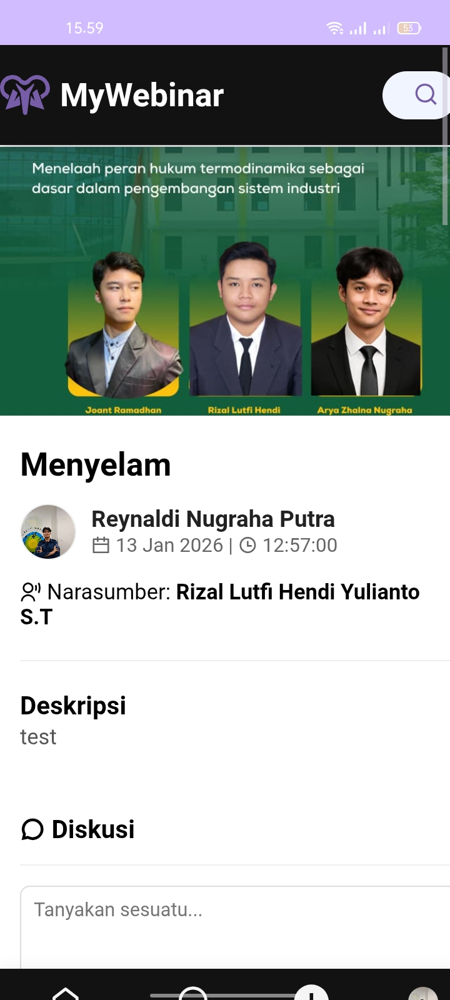
  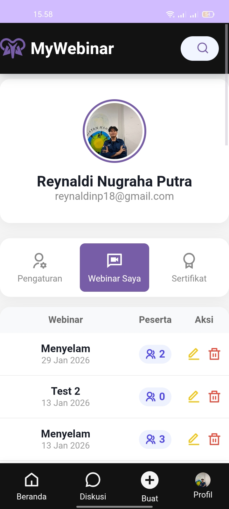
  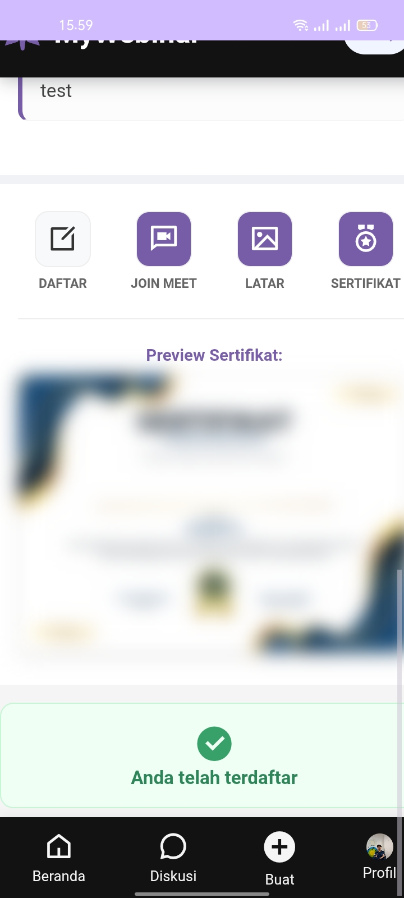
  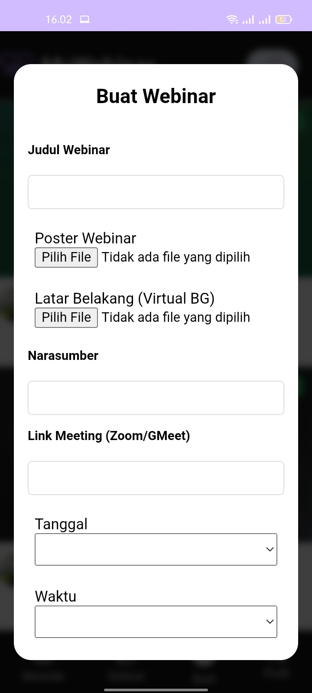
</p>

---

### 6. UX (User Experience) VIDEO PROTOTYPE Project
<p align="center">

</p>

---

### 7. Timeline Project ClickUp

```text
2025 | SEP | OKT | ... | 2026 | MAR | APR | MEI | JUN |
--------------------------------------------------------------
Setup & Design [====]
Implementasi AS     [==]
Integrasi AI (Inisiasi)        [==]
UI/UX Arsitektur AI               [==]
Coding Core & AI Chatbot              [===========]
Finalisasi & Dokumentasi                          [==]
Testing & Bug Fixing                                [==]
```

Berikut adalah detail jadwal pengerjaan proyek **MyWebinar** beserta progres integrasi fitur AI Chatbot terbaru:

| Tugas (Task) | Due Date | Status |
| :--- | :--- | :--- |
| Download & Install Android Studio | 18 Sep 2025 | Selesai |
| Membuat Storyboard Aplikasi MyWebinar | 28 Sep 2025 | Selesai |
| Membuat Akun ClickUp | 19 Sep 2025 | Selesai |
| Membuat MockUp dari Storyboard | 17 Okt 2025 | Selesai |
| Membuat UI (User Interface) di Figma | 17 Okt 2025 | Selesai |
| Implementasi di Android Studio | 19 Okt 2025 | Selesai |
| **Inisiasi & Analisis AI** | 13 Mar 2026 | Selesai |
| **Perancangan UI/UX & Arsitektur** | 27 Mar 2026 | Selesai |
| **Pengembangan Fitur Core & AI** | 22 Mei 2026 | Sedang Berjalan |
| **Dokumentasi & Finalisasi** | 05 Jun 2026 | Mendatang |
| **Testing & Bug Fixing** | 19 Jun 2026 | Mendatang |

- [ClickUp](https://sharing.clickup.com/90181810261/g/h/2kzm2e2n-658/ecff08a3c6fdc3c)
<br>

---

 ### 8. Figma Wireframe
- [Link Figma](https://www.figma.com/design/iwjr289lMfDCBZmQjJ0kks/MyWebinar-UI-UX-Design?node-id=1-18&t=Lw9OMroXqJQALsfL-1))

---

### 9. Cara Instalasi (Technical Requirements)
1.  Clone repository ini.
2.  Buka project menggunakan **Android Studio**.
3.  Pastikan API Key untuk AI Chatbot sudah terkonfigurasi di file `gradle.properties` atau `local.properties`.
4.  Jalankan aplikasi menggunakan Emulator atau Real Device.